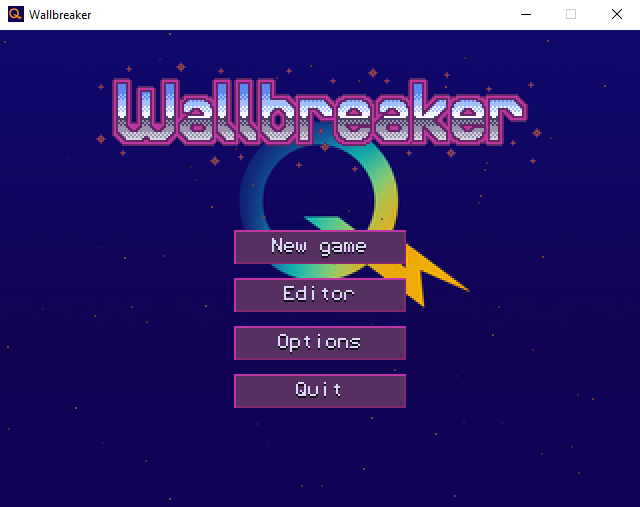
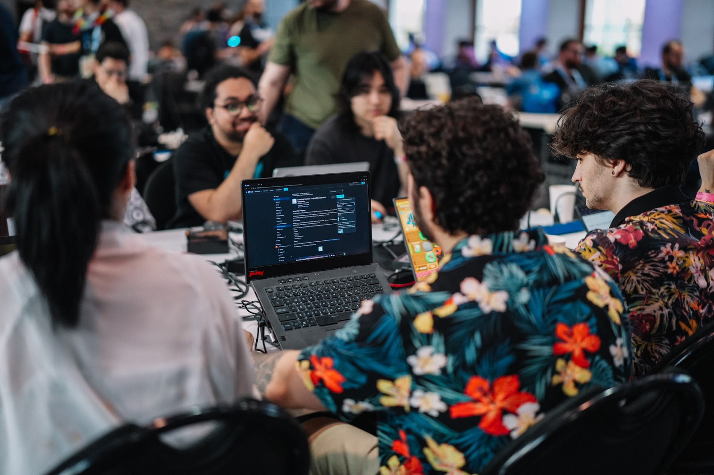
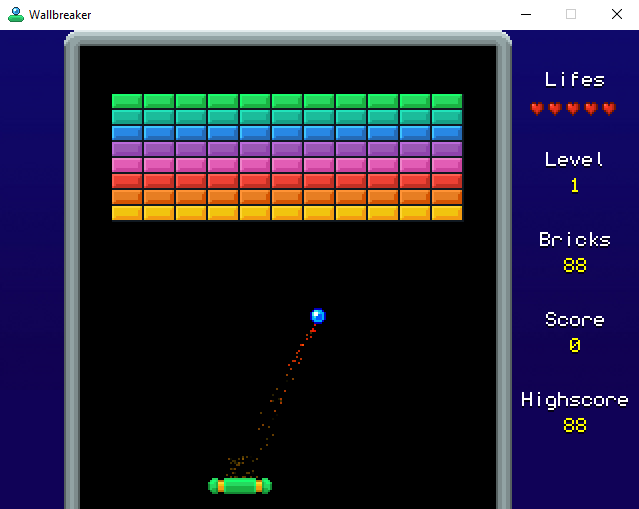

<!-- Banner / Logo -->
<!--

  

 -->
<!-- Title -->
<h1 align="center">🎮 Hydrobreaker ⚡️</h1>

  <strong>Jeu "Wallbreaker" rétro réalisé par notre équipe de stagiaires du Hackathon 2025</strong>

<!-- Badges -->

  
  
  

## 🚀 Aperçu
Hydrobreaker est un jeu d'arcade classique où vous contrôlez une raquette pour renvoyer une balle et détruire toutes les briques. Revisité avec des graphismes modernes, des power-ups, et un gameplay dynamique!

   <a href="https://github.com/hydroquebec/hydrobreaker/releases/download/v1.0/hydrobreaker_1.0_windows_amd64.zip">Gameplay Demo</a>

**Veuillez encourager notre équipe de stagiraires du Hackathon 2025 en devenant beta-testeur!**

Ce jeu pourrait être éventuellement utilisé lors des visites d'Hydro-Québec dans des écoles partenaires.
N'hésitez pas à remonter quelconque bug ou suggestion ✨️

<!-- PROJECT LOGO -->
 

  

  

    Hydrobreaker propose divers bonus, 20 niveaux et un éditeur de niveaux.
     
     
    <a href="https://github.com/hydroquebec/hydrobreaker/issues/new?labels=bug&template=bug-report---.md">Rapporter un bogue</a>
    &middot;
    <a href="https://github.com/hydroquebec/hydrobreaker/issues/new?labels=enhancement&template=feature-request---.md">Demander une fonctionnalité</a>
  

## 💻️ Bivouac Électronique 2025
Voici notre équipe en pleine compétition, nous avons eu beaucoup de plaisir à y participer!

<!-- ABOUT THE PROJECT -->
## 📝️ À Propos du Projet
<!--  -->
Ce jeu a été développé dans le cadre du Bivouac Électronique 2025, auquel ont participé plusieurs stagiaires et membres du personnel d'Hydro-Québec. 
Le Bivouac Électronique est un festival extérieur où, sur une période de trois jours, les participants doivent concevoir et implémenter un prototype de jeu afin de remporter un grand prix de 5000$. 
Bien que notre équipe n'ait pas remporté ce prix, on espère poursuivre le développement du jeu en vue de le distribuer pour nos visites dans les écoles partenaires.

<!-- GETTING STARTED -->
## ⚡️ Pour commencer
Pour faire simple, vous pouvez simplement télécharger l'exécutable du jeu à partir de la section "Releases".
Si vous souhaitez développer le jeu en vue d'en faire le développement ou de soumettre des améliorations, voici la marche à suivre.

#### Prérequis et installation
1. Installer la librairie SFML (www.sfml-dev.org).
2. Exécuter la commande: `make`
3. Exécuter le jeu: `./wallbreaker`

<!-- USAGE EXAMPLES -->
## 🎮️ Comment jouer
<!--  -->
- Déplacez la raquette avec la souris pour attraper la balle, ou utilisez les touches fléchées gauche/droite.
- Cliquez ou appuyez sur la barre d'espace pour libérer les balles collées à la raquette adhésive.
- Cliquez ou appuyez sur la barre d'espace pour tirer des lasers avec la raquette laser.
- Appuyez sur F2 pour prendre une capture d'écran (enregistrée dans le répertoire de configuration de l'application).

<!-- CONTRIBUTING -->
## 🫶️ Contribuer
Les contributions sont ce qui fait de la communauté open source un lieu si extraordinaire pour apprendre, s'inspirer et créer. Toutes vos contributions sont **très appréciées**.
Si vous avez une suggestion qui permettrait d'améliorer ce projet, veuillez créer une fourche du dépôt et créer une demande d'extraction. Vous pouvez également simplement ouvrir un ticket avec le tag « amélioration ».
N'oubliez pas de donner une étoile au projet ! Merci encore !
1. Créez une fourche du projet
2. Créez votre branche de fonctionnalités (`git checkout -b feature/AmazingFeature`)
3. Validez vos modifications (`git commit -m “Add some AmazingFeature”`)
4. Poussez vers la branche (`git push origin feature/AmazingFeature`)
5. Ouvrez une pull request
